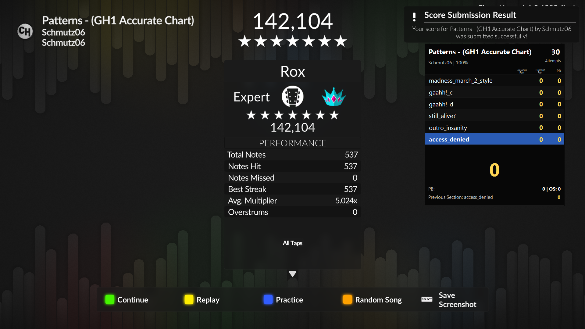
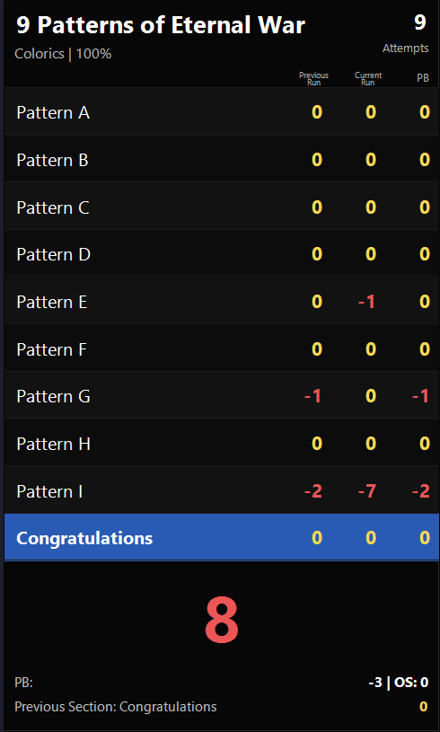

# StatTrack v1.1 BepInEx Edition

StatTrack v1.1 BepInEx Edition is a Clone Hero v1.1 NoteSplit mod built for the Unity IL2CPP version of the game. It runs through BepInEx 6 and does not patch or replace Clone Hero game binaries.

This update is mainly focused on bringing NoteSplit support back to Clone Hero v1.1. OBS exports are currently disabled for this update and will return behind an enable option in a later release.





## Features

- NoteSplit overlay for Clone Hero v1.1
- Accurate miss tracking through runtime hooks
- Section-aware current, previous run, and PB counters
- Separate tracking per song speed and difficulty
- Practice mode live tracking without saving attempts or PBs
- Bot mode protection so automated runs do not update PB data
- OBS text exports are currently disabled for this update
- Sharded song memory so large libraries do not require rewriting one huge memory file
- External `NoteSplit Overlay.exe` window for OBS window capture
- Right-click overlay menu for toggling always-on-top behavior
- Right-click purge actions for clearing current-song or all-song NoteSplit attempts/PBs
- Cached background note-tick preload to reduce song-start hitching

## Install

Download the latest release zip from the Releases page.

Extract the zip into the root of your Clone Hero v1.1 folder, the same folder that contains `Clone Hero.exe`.

After extraction, the Clone Hero folder should contain:

```text
BepInEx\
dotnet\
.doorstop_version
doorstop_config.ini
winhttp.dll
```

The mod should be installed at:

```text
BepInEx\plugins\StatTrackV11\
```

Launch `Clone Hero.exe`. The first launch can take longer while BepInEx generates IL2CPP interop files. The NoteSplit overlay opens after entering a song.

## Data And OBS Paths

StatTrack stores user data under:

```text
%LOCALAPPDATA%\StatTrack
```

OBS export support is currently disabled for this update. This build is focused on restoring NoteSplit support first, and the folder is reserved for a later release:

```text
%LOCALAPPDATA%\StatTrack\obs
```

The main files are:

```text
config.json
memory.json
state.json
desktop-style.json
memory\songs\*.json
```

`memory.json` stores small global data. Per-song NoteSplit history is stored as sharded files under `memory\songs`.

## NoteSplit Behavior

NoteSplit tracks the total miss count itself while a song is active. Overstrums are shown by turning the corresponding section's zero red, so a red `0` means the section had no missed notes but the FC was broken by an overstrum.

Right-click the external NoteSplit overlay to open its menu. From there you can uncheck `Always on top`, purge the current song's NoteSplit attempts/PBs, or purge all NoteSplit attempts/PBs. Purge actions clear attempts, starts/restarts, previous-run section values, song PBs, section PBs, FC flags, and best streak data.

## Notes

- This release is for Clone Hero v1.1 IL2CPP.
- It includes BepInEx 6 IL2CPP x64 build `6.0.0-be.755+3fab71a`.
- It does not bypass online systems, leaderboards, DRM, or score submission.
- It does not modify `Clone Hero.exe`, `GameAssembly.dll`, or game data files.

## Troubleshooting

If the mod does not load:

1. Confirm the files were extracted into the folder containing `Clone Hero.exe`.
2. Confirm `BepInEx\plugins\StatTrackV11\StatTrackV11.Plugin.dll` exists.
3. Launch the game once and check `BepInEx\LogOutput.log`.
4. If the first launch takes a while, wait for BepInEx IL2CPP interop generation to finish.

If the overlay does not appear, enter a song. The overlay is intentionally not started during game boot.

## Third-Party Software

This distribution bundles BepInEx and .NET runtime components required by the loader. See `THIRD_PARTY_NOTICES.txt` for attribution and license notes.
